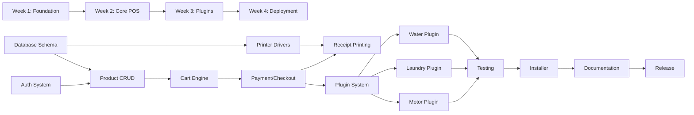

# Project Milestones — Universal POS System

> **Version:** 1.0  
> **Last Updated:** 2026-06-05  
> **Total Duration:** 4 Weeks (20 working days)  
> **Team Size:** 1–2 developers

---

## Overview

```
Week 1              Week 2              Week 3              Week 4
┌──────────────┐    ┌──────────────┐    ┌──────────────┐    ┌──────────────┐
│   PRINTER    │    │   CORE POS   │    │   PLUGINS    │    │  DEPLOYMENT  │
│  ABSTRACTION │───▶│   ENGINE     │───▶│  & BUSINESS  │───▶│  & POLISH    │
│  + DB SETUP  │    │   + UI       │    │    LOGIC     │    │              │
└──────────────┘    └──────────────┘    └──────────────┘    └──────────────┘
  Foundation          Core Product        Customization       Ship It
```

---

## Week 1: Printer Abstraction + Foundation (Days 1–5)

### Goal
Establish the project foundation: database, server, printer driver abstraction layer, and basic frontend scaffolding. By end of week, you can connect a thermal printer and print a test receipt from the API.

### Tasks

| Day | Task | Description | Deliverable |
|-----|------|-------------|-------------|
| **1** | **Project Scaffolding** | | |
| | 1.1 | Initialize Node.js project with Express, folder structure per `folder_structure.txt` | `package.json`, directory tree |
| | 1.2 | Initialize React + Vite project with PWA plugin | `client/` scaffolded with `vite.config.js` |
| | 1.3 | Set up ESLint, Prettier, `.editorconfig` | Config files |
| | 1.4 | Set up SQLite database with `better-sqlite3` | `db/pos.db` created on startup |
| | 1.5 | Create database migration system (simple versioned SQL files) | `migrations/` folder with runner |
| **2** | **Database Schema** | | |
| | 2.1 | Implement full schema from `database_schema.sql` | All tables created |
| | 2.2 | Create seed data script (sample business, categories, products) | `scripts/seed.js` |
| | 2.3 | Implement database helper module (query, run, transaction) | `server/db/index.js` |
| | 2.4 | Add WAL mode, foreign key enforcement, auto-backup | Database config |
| **3** | **Printer Driver Interface** | | |
| | 3.1 | Create `PrinterDriver` abstract interface | `printer-drivers/PrinterDriver.js` |
| | 3.2 | Implement `ThermalPrinter` driver (ESC/POS via node-escpos) | `printer-drivers/ThermalPrinter.js` |
| | 3.3 | Implement `ImpactPrinter` driver (raw text via COM/LPT port) | `printer-drivers/ImpactPrinter.js` |
| | 3.4 | Implement `ConsolePrinter` driver (for development/testing) | `printer-drivers/ConsolePrinter.js` |
| | 3.5 | Create printer auto-detection utility | `printer-drivers/detect.js` |
| **4** | **Printer API & Templates** | | |
| | 4.1 | Build printer management API endpoints (`/api/printers/*`) | CRUD + detect + test print |
| | 4.2 | Create receipt template engine (variable substitution) | `server/services/templateEngine.js` |
| | 4.3 | Create default receipt template | `templates/default-receipt.json` |
| | 4.4 | Implement print queue (job queuing, retry on failure) | `server/services/printQueue.js` |
| | 4.5 | Write printer integration tests | `tests/printer.test.js` |
| **5** | **Auth Foundation + Week 1 Review** | | |
| | 5.1 | Implement user/auth model (PIN-based login) | `server/models/User.js` |
| | 5.2 | Build auth middleware (JWT token, session) | `server/middleware/auth.js` |
| | 5.3 | Build auth API (`/api/auth/login`, `/api/auth/logout`) | Auth endpoints working |
| | 5.4 | Create basic React login page | `client/pages/Login.jsx` |
| | 5.5 | **Week 1 demo**: Print test receipt from API call | ✅ End-to-end printer test |

### Week 1 Acceptance Criteria

- [ ] Server starts and creates SQLite database automatically
- [ ] All database tables exist with proper indexes and foreign keys
- [ ] Thermal printer driver can print formatted receipt via ESC/POS
- [ ] Impact printer driver can print plain text receipt
- [ ] Console printer driver outputs receipt to terminal (dev mode)
- [ ] Printer auto-detection finds connected USB printers
- [ ] Print queue handles offline printer (queues and retries)
- [ ] Auth API returns JWT token on valid PIN
- [ ] React app loads login page
- [ ] Seed data populates sample business, categories, products

### Week 1 Risks & Mitigations

| Risk | Mitigation |
|------|-----------|
| USB printer not detected on Windows | Use Windows printer name fallback; test with multiple printers |
| node-escpos compatibility issues | Have raw ESC/POS byte-level fallback ready |
| SQLite WAL mode issues | Test with concurrent reads/writes |

---

## Week 2: Core POS Engine + UI (Days 6–10)

### Goal
Build the complete POS transaction flow: product management, cart, checkout, payment, receipt printing. By end of week, a cashier can log in, add items to cart, process payment, and print a receipt.

### Tasks

| Day | Task | Description | Deliverable |
|-----|------|-------------|-------------|
| **6** | **Product & Category Management** | | |
| | 6.1 | Build product CRUD API (`/api/products/*`) | Full CRUD with search |
| | 6.2 | Build category CRUD API (`/api/categories/*`) | Nested categories |
| | 6.3 | Build product management UI (admin panel) | Add/edit/delete products |
| | 6.4 | Implement product search (by name, barcode, category) | Search endpoint + UI |
| | 6.5 | Implement CSV import for products | Upload + validation + import |
| **7** | **Cart & Transaction Engine** | | |
| | 7.1 | Build cart state management (React Context or Zustand) | Cart provider with add/remove/update |
| | 7.2 | Build POS main screen with product grid and cart sidebar | `client/pages/POS.jsx` |
| | 7.3 | Implement cart operations: add, remove, update qty, discount | Full cart manipulation |
| | 7.4 | Implement cart hold/park (up to 5 parked carts) | Park and recall functionality |
| | 7.5 | Build transaction API (`/api/transactions/*`) | Create, void, refund |
| **8** | **Payment & Checkout** | | |
| | 8.1 | Build checkout/payment dialog UI | Payment modal with amount input |
| | 8.2 | Implement cash payment with change calculation | Denomination buttons, auto-change |
| | 8.3 | Implement GCash/Maya payment recording | Reference number input |
| | 8.4 | Implement split payment (multi-tender) | Multiple payment methods per transaction |
| | 8.5 | Implement credit/utang payment with customer link | Credit tracking |
| **9** | **Receipt Generation & Printing** | | |
| | 9.1 | Build receipt data formatter (transaction → receipt template) | `server/services/receiptFormatter.js` |
| | 9.2 | Integrate checkout flow with printer (auto-print receipt) | End-to-end: pay → print |
| | 9.3 | Build receipt reprint functionality | Search transaction → reprint |
| | 9.4 | Build receipt template editor UI (basic) | Edit header, footer text |
| | 9.5 | Implement void/refund flow with manager PIN | Authorization check |
| **10** | **Settings & Week 2 Review** | | |
| | 10.1 | Build settings API and UI (business info, tax rate, language) | Settings page |
| | 10.2 | Implement i18n (Filipino/English) with i18next | Language switcher |
| | 10.3 | Build customer CRUD API and basic UI | Customer list + form |
| | 10.4 | Implement keyboard shortcuts (F2-search, F5-pay, etc.) | Keyboard navigation |
| | 10.5 | **Week 2 demo**: Complete sale from login → cart → pay → receipt | ✅ Full POS flow |

### Week 2 Acceptance Criteria

- [ ] Products can be created, edited, deleted with categories
- [ ] Product search works by name and barcode
- [ ] POS screen shows product grid + cart sidebar
- [ ] Items can be added to cart, quantity adjusted, discounts applied
- [ ] Cart can be parked and recalled
- [ ] Cash payment processes with correct change calculation
- [ ] GCash/Maya payments can be recorded with reference number
- [ ] Split payment works (part cash, part GCash)
- [ ] Receipt prints automatically after payment
- [ ] Receipt can be reprinted from transaction history
- [ ] Void requires manager PIN
- [ ] UI is bilingual (Filipino/English toggle)
- [ ] Keyboard shortcuts work

### Week 2 Risks & Mitigations

| Risk | Mitigation |
|------|-----------|
| Cart state lost on browser crash | Auto-save cart to localStorage + server |
| Complex split payment edge cases | Limit to 3 payment methods per transaction |
| Receipt template formatting issues | Test on both 58mm and 80mm paper widths |

---

## Week 3: Business Plugins (Days 11–15)

### Goal
Build the plugin system and implement all three business-type plugins: Water Station, Laundry Shop, Motorcycle Repair. Each plugin adds custom fields, workflows, and UI components to the core POS.

### Tasks

| Day | Task | Description | Deliverable |
|-----|------|-------------|-------------|
| **11** | **Plugin Architecture** | | |
| | 11.1 | Design and implement plugin loader system | `server/plugins/loader.js` |
| | 11.2 | Define plugin manifest format (`plugin.json`) | Schema + validation |
| | 11.3 | Build plugin registration API (`/api/plugins/*`) | Install, activate, deactivate |
| | 11.4 | Create plugin hooks system (lifecycle events) | `onInstall`, `onActivate`, `onTransaction`, etc. |
| | 11.5 | Build plugin management UI (admin) | Plugin list, activate/deactivate toggle |
| **12** | **Water Station Plugin** | | |
| | 12.1 | Create water station plugin scaffold | `plugins/waterstation/plugin.json` |
| | 12.2 | Implement container type management (slim, round, 5-gal, 1-gal) | Custom product types |
| | 12.3 | Implement container deposit tracking (borrow/return) | Deposit ledger per customer |
| | 12.4 | Implement delivery order management | Delivery form, rider assignment |
| | 12.5 | Create water station receipt template (with deposit info) | Custom receipt format |
| **13** | **Laundry Shop Plugin** | | |
| | 13.1 | Create laundry plugin scaffold | `plugins/laundry/plugin.json` |
| | 13.2 | Implement service type management (wash-dry-fold, dry clean, etc.) | Service catalog with kg/piece pricing |
| | 13.3 | Implement job order system (create, status tracking) | Job order CRUD + status workflow |
| | 13.4 | Implement claim stub printing (with barcode) | Barcode generation + custom receipt |
| | 13.5 | Implement job order status board UI | Kanban-style status board |
| **14** | **Motorcycle Repair Plugin** | | |
| | 14.1 | Create motor repair plugin scaffold | `plugins/motorepair/plugin.json` |
| | 14.2 | Implement job order system (motorcycle info, complaint, status) | Job order with vehicle details |
| | 14.3 | Implement parts inventory with stock tracking | Parts CRUD with auto-deduct |
| | 14.4 | Implement labor + parts billing on job orders | Itemized billing |
| | 14.5 | Create itemized receipt (parts section + labor section) | Custom receipt format |
| **15** | **Reports & Week 3 Review** | | |
| | 15.1 | Build daily sales summary report | API + UI with chart |
| | 15.2 | Build sales by product/category report | Ranked list with totals |
| | 15.3 | Build Z-report (end of day cash reconciliation) | Printable Z-report |
| | 15.4 | Build CSV/PDF export for reports | Export buttons |
| | 15.5 | **Week 3 demo**: Full workflow for each business type | ✅ All 3 plugins working |

### Week 3 Acceptance Criteria

- [ ] Plugin system loads plugins from `/plugins` directory
- [ ] Plugins can be activated/deactivated from admin UI
- [ ] **Water Station**: Container deposits tracked per customer; delivery orders managed; custom receipt
- [ ] **Laundry**: Job orders created with weight + service type; claim stubs printed with barcode; status board works
- [ ] **Motor Repair**: Job orders with motorcycle details; parts auto-deducted from inventory; itemized receipt
- [ ] Daily sales summary shows correct totals
- [ ] Z-report prints with cash reconciliation
- [ ] Reports export to CSV

### Week 3 Risks & Mitigations

| Risk | Mitigation |
|------|-----------|
| Plugin isolation (bugs in one affect others) | Wrap plugin execution in try-catch; error boundary in React |
| Complex job order status workflows | Use simple linear state machine; no branching states in V1 |
| Barcode printing compatibility | Use Code128 (widely supported); fallback to text ID |

---

## Week 4: Deployment & Polish (Days 16–20)

### Goal
Production-ready deployment: installer, documentation, testing, performance optimization, and final polish. By end of week, the system is ready for real-world pilot deployment.

### Tasks

| Day | Task | Description | Deliverable |
|-----|------|-------------|-------------|
| **16** | **PWA & Offline** | | |
| | 16.1 | Configure service worker for full offline caching | All assets cached |
| | 16.2 | Implement offline data queue (queue API calls when offline) | Sync when reconnected |
| | 16.3 | Add PWA manifest (icons, splash screen, theme) | `manifest.json` |
| | 16.4 | Test PWA install on Chrome/Edge | Installable, works offline |
| | 16.5 | Add "offline" indicator in UI | Visual status badge |
| **17** | **Testing & Bug Fixes** | | |
| | 17.1 | Write API integration tests (auth, products, transactions) | Test suite with 80%+ coverage |
| | 17.2 | Write React component tests (cart, checkout, POS screen) | Component test suite |
| | 17.3 | End-to-end tests (Playwright: login → sale → receipt) | E2E test suite |
| | 17.4 | Fix bugs found during testing | Bug fixes |
| | 17.5 | Performance testing on low-spec PC (4GB RAM, HDD) | Performance report |
| **18** | **Installer & Packaging** | | |
| | 18.1 | Create production build script (client + server) | `scripts/build.js` |
| | 18.2 | Create Windows installer (NSIS or Electron builder) | `.exe` installer |
| | 18.3 | Create auto-start configuration (Windows startup) | Server starts on boot |
| | 18.4 | Create backup/restore utility script | `scripts/backup.js`, `scripts/restore.js` |
| | 18.5 | Test clean install on fresh Windows 10/11 machine | Install → configure → first sale |
| **19** | **Documentation & Training** | | |
| | 19.1 | Write user manual (with screenshots, Filipino translation) | `docs/user-manual/` |
| | 19.2 | Write admin setup guide (printer configuration, business setup) | `docs/admin-guide.md` |
| | 19.3 | Write developer documentation (plugin development guide) | `docs/plugin-dev-guide.md` |
| | 19.4 | Create video tutorial scripts (3-minute quick start) | Tutorial outline |
| | 19.5 | Write troubleshooting guide (common issues + fixes) | `docs/troubleshooting.md` |
| **20** | **Final Review & Release** | | |
| | 20.1 | Final QA pass — all critical paths tested | Sign-off checklist |
| | 20.2 | Security review (auth, PIN storage, data access) | Security checklist |
| | 20.3 | Create release notes (V1.0) | `CHANGELOG.md` |
| | 20.4 | Tag release in Git (v1.0.0) | Git tag + build artifact |
| | 20.5 | **Final demo**: Install on clean PC → setup → full sale cycle | ✅ Release candidate |

### Week 4 Acceptance Criteria

- [ ] PWA installs and works fully offline
- [ ] Service worker caches all static assets
- [ ] API test coverage > 80%
- [ ] E2E test: login → add products → sale → payment → receipt → report
- [ ] Windows installer works on clean Windows 10 and 11
- [ ] Server auto-starts on Windows boot
- [ ] Backup creates timestamped copy of database
- [ ] Restore replaces database from backup file
- [ ] User manual covers all features with screenshots
- [ ] Installer size < 80 MB
- [ ] Application starts in < 5 seconds on target hardware
- [ ] 100 transactions can be processed without performance degradation

### Week 4 Risks & Mitigations

| Risk | Mitigation |
|------|-----------|
| Installer issues on different Windows versions | Test on Win 10 Home, Pro, Win 11 Home |
| Service worker caching bugs | Use Workbox (via vite-plugin-pwa) for reliable caching |
| Performance on HDD (not SSD) | Pre-warm SQLite; keep database indexed; lazy-load reports |

---

## Milestone Summary

| Week | Milestone | Key Deliverable | Demo |
|------|-----------|----------------|------|
| 1 | **Printer Abstraction + Foundation** | Printer drivers + database + auth | Print test receipt from API |
| 2 | **Core POS Engine** | Full sale cycle: cart → pay → receipt | Complete sale end-to-end |
| 3 | **Business Plugins** | Water, Laundry, Motor plugins + reports | Full workflow per business type |
| 4 | **Deployment & Polish** | Installer + PWA + docs + tests | Clean install → first sale |

---

## Definition of Done (Global)

Every task is considered "done" when:

1. ✅ Code is written and works as described
2. ✅ Code follows project ESLint/Prettier rules
3. ✅ Basic tests exist for the feature (API: integration test, UI: smoke test)
4. ✅ Feature works on Chrome and Edge browsers
5. ✅ Feature works offline (if applicable)
6. ✅ UI text is available in both Filipino and English
7. ✅ Code is committed with descriptive commit message
8. ✅ No console errors or warnings in production mode

---

## Dependencies



---

## Post-V1 Roadmap (Future)

| Version | Features |
|---------|----------|
| V1.1 | SMS notifications (Semaphore), barcode scanner support |
| V1.2 | Multi-terminal support (WebSocket sync) |
| V2.0 | Cloud sync, multi-branch, MySQL migration |
| V2.1 | BIR CAS/CRM certification |
| V2.2 | Mobile app (React Native) |
| V3.0 | Online ordering, GCash API integration |
